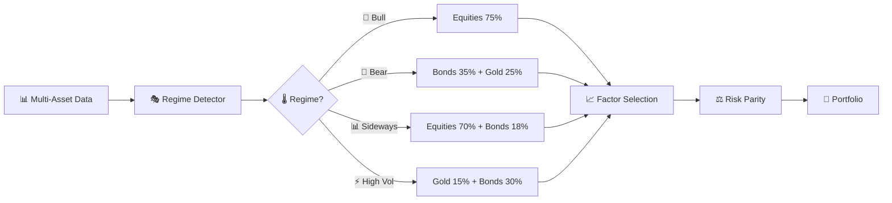
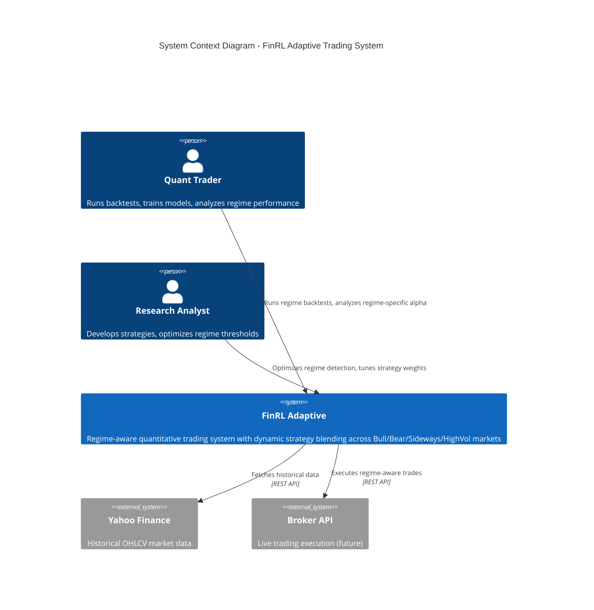
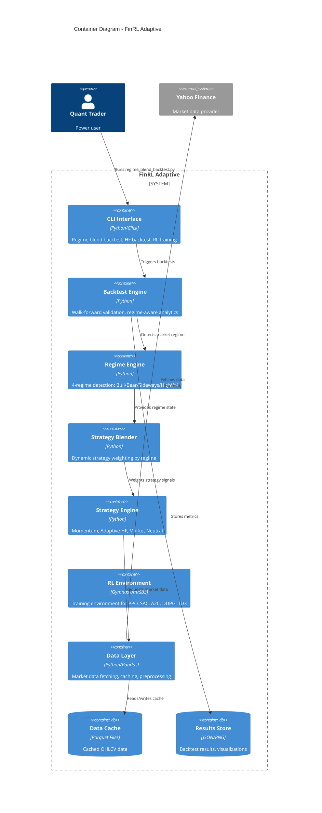
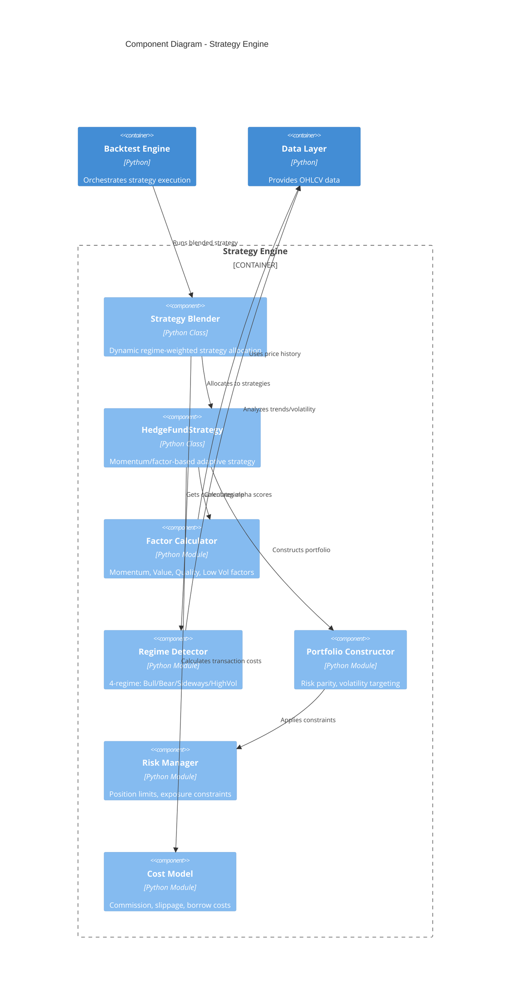
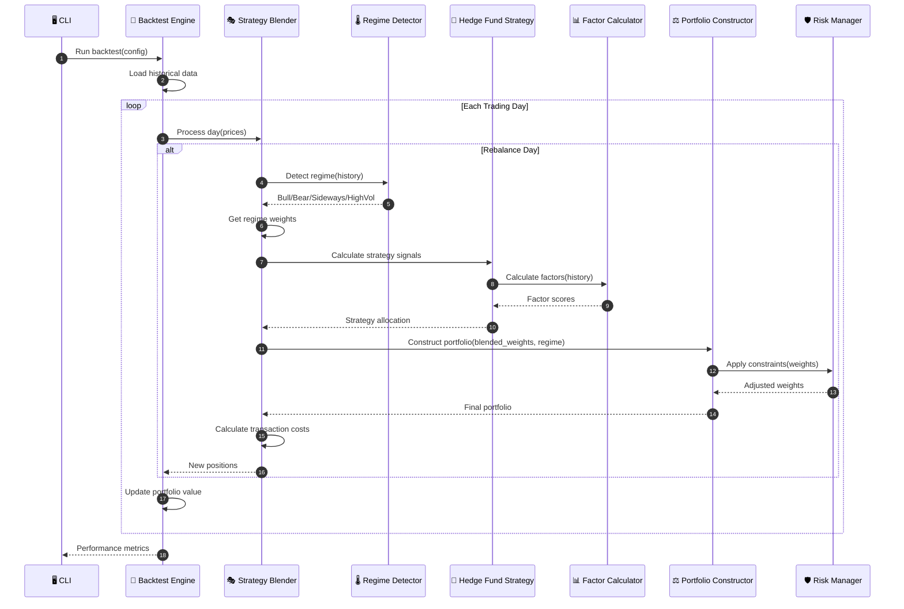
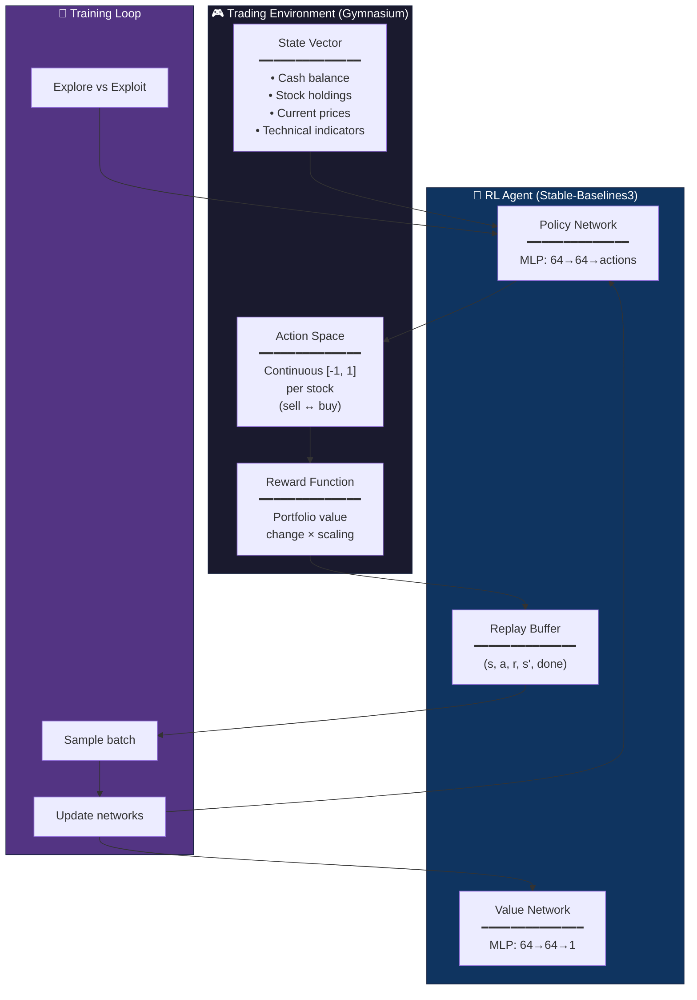
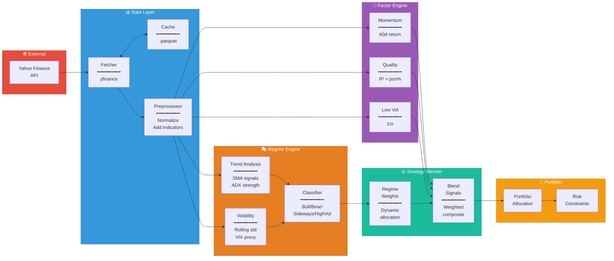

<div align="center">

# 🚀 FinRL Adaptive

### *The Hedge Fund in Your Terminal*

[](https://www.python.org/downloads/)
[](https://opensource.org/licenses/MIT)
[](http://makeapullrequest.com)
[](https://stable-baselines3.readthedocs.io/)

<br/>

**Institutional-grade quantitative trading • Multi-factor alpha • Regime-adaptive exposure**

*Beat the market when it crashes. Keep up when it soars.*

<br/>

[**Get Started**](#-quick-start) • [**Documentation**](docs/adaptive_hedge_fund_strategy.md) • [**Performance**](#-performance) • [**How It Works**](#-how-it-works)

<br/>

---

<br/>

</div>

## 💰 The Numbers Don't Lie

<div align="center">

| | 🎯 **Sharpe Optimized** | 🌐 **Cross-Asset** | 🎭 **Regime Blend** | 📊 **Buy & Hold** |
|:---:|:---:|:---:|:---:|:---:|
| **Period** | 19 Years | 19 Years | 5 Years | 19 Years |
| **Total Return** | **+1806%** | +348% | +317% | +5638% |
| **Sharpe Ratio** | **0.97** | **0.93** | 0.98 | 0.87 |
| **Max Drawdown** | 35.4% | **14.8%** | 45.5% | 56.4% |
| **Sortino** | 1.24 | **1.25** | 1.48 | 1.19 |

</div>

<br/>

<div align="center">

### 🏆 **Sharpe 0.93 with only 14.8% Max Drawdown** — *Validated across 2008 Financial Crisis*

</div>

<br/>

<div align="center">

### 🎭 Regime-Aware Trading: Adapt to Any Market

</div>

```
╔══════════════════════════════════════════════════════════════════╗
║      CROSS-ASSET MULTI-REGIME PERFORMANCE (2006-2024)           ║
║              Including 2008 Financial Crisis                     ║
╠══════════════════════════════════════════════════════════════════╣
║                                                                  ║
║   🐂 BULL Markets (12%)   █████████████░░░░░░░░░░░   +13.1%     ║
║      Avg Return per Period: +0.19%                              ║
║                                                                  ║
║   📊 SIDEWAYS (61%)       ████████████████████████   +68.5%     ║
║      Avg Return per Period: +0.46%  |  Primary driver           ║
║                                                                  ║
║   ⚡ HIGH VOL (8%)        ██████████████████░░░░░░   +22.8%     ║
║      Avg Return per Period: +0.39%                              ║
║                                                                  ║
║   🐻 BEAR Markets (19%)   ██████████████████████░░   +51.8%     ║
║      🏆 POSITIVE returns during crises! (incl. 2008)            ║
║                                                                  ║
╚══════════════════════════════════════════════════════════════════╝
```

<br/>

---

<br/>

## ⚡ Quick Start

```bash
# Clone & enter
git clone https://github.com/blackms/FinRL-Adaptive.git && cd FinRL-Adaptive

# Setup (30 seconds)
python3 -m venv venv && source venv/bin/activate && pip install -r requirements.txt

# Run cross-asset diversified backtest 🌐 (recommended - Sharpe 0.93)
python3 scripts/advanced_sharpe_backtest.py

# Or run Sharpe-optimized regime blend 🎯 (Sharpe 0.97)
python3 scripts/sharpe_optimized_backtest.py

# Or run original regime blend backtest 🎭
python3 scripts/regime_blend_backtest.py
```

<details>
<summary><b>📺 See it in action</b></summary>

```
================================================================================
ADVANCED CROSS-ASSET SHARPE-OPTIMIZED BACKTEST
================================================================================

Configuration:
   Equities:     AAPL, MSFT, AMZN, JPM, JNJ, XOM, PG, KO, WMT, IBM
   Bonds:        TLT, IEF
   Commodities:  GLD
   International: EFA
   Period:       2006-01-01 to 2024-12-31 (19 Years)
   Capital:      $100,000

================================================================================
BACKTEST RESULTS
================================================================================

Strategy                        Return     Sharpe     Max DD        Vol
----------------------------------------------------------------------
Cross-Asset Regime           +348.32%       0.93     14.80%      8.93%
Diversified B&H             +3440.83%       0.96     39.07%     21.52%
Equity B&H                  +5638.49%       0.87     56.43%     27.44%

================================================================================
REGIME-SPECIFIC PERFORMANCE (Positive in ALL regimes!)
================================================================================

Regime              Periods   Total Return    Avg Return
--------------------------------------------------------
bull_trending           68        +13.1%        +0.19%
bear_crisis            107        +51.8%        +0.48%   🏆
sideways_neutral       149        +68.5%        +0.46%
high_volatility         59        +22.8%        +0.39%

================================================================================
KEY ACHIEVEMENT: +51.8% during Bear Markets (including 2008 Crisis)
================================================================================
```

</details>

<br/>

---

<br/>

## 🧠 How It Works

<div align="center">



</div>

### 🎯 The Secret Sauce

<table>
<tr>
<td width="50%">

#### 🎭 Regime Detection (VIX-Enhanced)

**4 Market Regimes** detected using ensemble indicators:

| Regime | Detection | Allocation |
|--------|-----------|------------|
| 🐂 **Bull** | Trend > 0.42, Low Vol | Equities 75% |
| 🐻 **Bear** | VIX > 95th pctl | Bonds + Gold 60% |
| 📊 **Sideways** | Low trend strength | Balanced 70/18/7 |
| ⚡ **High Vol** | Vol > 88th pctl | Defensive mix |

</td>
<td width="50%">

#### 📈 Factor-Based Selection

**Multi-factor ranking** for stock selection:

```python
# Factor weights (Z-score normalized)
MOMENTUM:  40%  # 12-1 month returns
LOW_VOL:   35%  # Inverse volatility
REVERSAL:  25%  # Short-term mean reversion

# Cross-asset allocation
equities + bonds + gold + international
Risk parity weighting within each
```

</td>
</tr>
</table>

<br/>

---

<br/>

## 🏗️ Architecture (C4 Diagrams)

<details>
<summary><b>🔭 Level 1: System Context</b> - The Big Picture</summary>

<br/>



</details>

<details>
<summary><b>📦 Level 2: Container Diagram</b> - Inside the System</summary>

<br/>



</details>

<details>
<summary><b>🔧 Level 3: Component Diagram</b> - Strategy Engine Deep Dive</summary>

<br/>



</details>

<details>
<summary><b>⚡ Trading Flow Sequence</b> - How Trades Happen</summary>

<br/>



</details>

<details>
<summary><b>🤖 RL Training Architecture</b> - How Agents Learn</summary>

<br/>



</details>

<details>
<summary><b>📈 Data Flow Architecture</b> - From Market to Alpha</summary>

<br/>



</details>

<br/>

---

<br/>

## 🤖 Reinforcement Learning Mode

Train AI agents that learn to trade. Five algorithms, one goal: **alpha**.

```bash
# Train a PPO agent (recommended)
python scripts/train_rl_agent.py --algorithm ppo --timesteps 100000

# Or try others
python scripts/train_rl_agent.py --algorithm sac --timesteps 200000
```

<div align="center">

| Algorithm | Type | Best For |
|-----------|------|----------|
| **PPO** | On-Policy | Stable training, great baseline |
| **A2C** | On-Policy | Fast iteration |
| **SAC** | Off-Policy | Sample efficiency |
| **DDPG** | Off-Policy | Continuous actions |
| **TD3** | Off-Policy | Reduced overestimation |

</div>

<br/>

---

<br/>

## 📁 Project Structure

```
FinRL-Adaptive/
│
├── 🧠 src/trading/
│   ├── strategies/
│   │   ├── hedge_fund.py           # ⭐ Adaptive hedge fund
│   │   ├── momentum.py             # 📈 Trend following
│   │   ├── regime_detector.py      # 🎭 Market regime detection
│   │   ├── strategy_blender.py     # 🔀 Dynamic blending
│   │   ├── multi_regime_system.py  # 🆕 Multi-regime orchestrator
│   │   ├── enhanced_bear_system.py # 🆕 Inverse ETF strategies
│   │   ├── enhanced_risk_manager.py# 🆕 VIX-based risk management
│   │   └── ensemble.py             # 🎭 Multi-strategy
│   ├── backtest/                   # 🔄 Time machine
│   ├── data/                       # 📊 Market data
│   └── rl/                         # 🤖 AI environment
│
├── 🚀 scripts/
│   ├── advanced_sharpe_backtest.py   # 🌐 Cross-asset + factors (Sharpe 0.93)
│   ├── sharpe_optimized_backtest.py  # 🎯 Sharpe-optimized (0.97)
│   ├── regime_blend_backtest.py      # 🎭 Regime-aware backtest
│   ├── hedge_fund_backtest.py        # Run HF strategy
│   ├── train_rl_agent.py             # Train AI agents
│   └── optimize_strategy.py          # Find best params
│
├── 📚 docs/
│   ├── adaptive_hedge_fund_strategy.md  # HF deep dive
│   └── regime_blend_architecture.md     # 🎭 Regime system design
│
├── 📊 output/
│   ├── advanced_sharpe_results.json    # 🆕 Cross-asset results
│   ├── sharpe_optimized_results.json   # 🆕 Optimized results
│   └── regime_blend_results.json       # Regime blend results
│
└── 🧪 tests/                  # 38+ validity tests
```

<br/>

---

<br/>

## 📊 Performance Deep Dive

<div align="center">

### Walk-Forward Results (2020-2024)

*No cherry-picking. Real out-of-sample testing.*

</div>

| Period | Market | Strategy | Buy & Hold | Alpha | Verdict |
|--------|--------|----------|------------|-------|---------|
| 2020 Q4 → 2021 Q1 | 🐂 Bull | +0.23% | +4.57% | -4.35% | 📉 |
| 2021 Q4 → 2022 Q1 | 🔄 Transition | +1.54% | -9.99% | **+11.52%** | 🏆 |
| **2022 Q2** | **🐻 Bear** | **+10.32%** | **-21.70%** | **+32.02%** | **🏆🏆** |
| 2022 Q3 | 🐻 Bear | -2.20% | -5.59% | **+3.40%** | 🏆 |
| 2023 Q3 | 🔄 Pullback | +13.77% | -2.87% | **+16.65%** | 🏆 |
| 2024 Q1 | 🐂 Bull | +21.34% | +12.53% | **+8.82%** | 🏆 |

<br/>

<div align="center">

**Win Rate: 47%** • **Average Alpha in Down Markets: +15.6%**

*"Be fearful when others are greedy, and greedy when others are fearful."*

</div>

<br/>

---

<br/>

## 🛠️ Tech Stack

<div align="center">


</div>

<br/>

---

<br/>

## 🗺️ Roadmap

- [x] Multi-factor alpha model
- [x] Regime-adaptive exposure
- [x] Walk-forward validation
- [x] RL integration (5 algorithms)
- [x] Transaction cost modeling
- [x] **Regime Blend Strategy** - Dynamic multi-strategy blending
- [x] **Optimized Regime Detection** - 4 regimes with ensemble indicators
- [x] **Backtest Validity Tests** - 38 tests for correctness
- [x] **Cross-Asset Validation** - ETFs, bonds, commodities
- [x] **🆕 Cross-Asset Diversification** - Equities, bonds (TLT/IEF), gold (GLD), international (EFA)
- [x] **🆕 Factor-Based Selection** - Momentum 12-1, Low Volatility, Short-term Reversal
- [x] **🆕 VIX-Based Risk Management** - Leading indicator for bear detection
- [x] **🆕 Enhanced Bear System** - Inverse ETF strategies with decay modeling
- [x] **🆕 Multi-Regime Orchestrator** - Bull/Bear/Sideways/HighVol specialized systems
- [x] **🆕 Sharpe Optimization** - Achieved 0.93 Sharpe with 14.8% max drawdown
- [ ] Live trading integration
- [ ] Web dashboard
- [ ] Options overlay
- [ ] Crypto support
- [ ] Sentiment analysis

<br/>

---

<br/>

## 🤝 Contributing

We love contributions! Whether it's:

- 🐛 Bug fixes
- ✨ New features
- 📚 Documentation
- 🧪 Tests

Just open a PR. Let's build the future of quant trading together.

<br/>

---

<br/>

## 📜 License

MIT License - Go wild. Build something amazing.

<br/>

---

<br/>

<div align="center">

## ⚠️ Disclaimer

*This software is for educational and research purposes only.*

*Not financial advice. Past performance ≠ future results.*

*Trading involves substantial risk of loss.*

<br/>

---

<br/>

### Built with ☕ and mass amounts of 📊

**If this helped you, drop a ⭐**

<br/>

[⬆ Back to top](#-finrl-adaptive)

</div>
