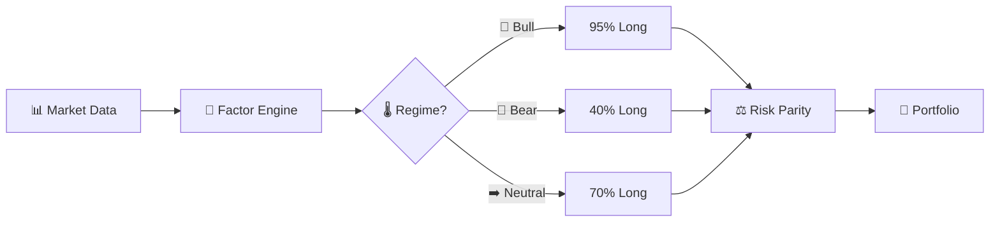

<div align="center">

# 🚀 FinRL Adaptive

### *The Hedge Fund in Your Terminal*

[](https://www.python.org/downloads/)
[](https://opensource.org/licenses/MIT)
[](http://makeapullrequest.com)
[](https://stable-baselines3.readthedocs.io/)

<br/>

**Institutional-grade quantitative trading • Multi-factor alpha • Regime-adaptive exposure**

*Beat the market when it crashes. Keep up when it soars.*

<br/>

[**Get Started**](#-quick-start) • [**Documentation**](docs/adaptive_hedge_fund_strategy.md) • [**Performance**](#-performance) • [**How It Works**](#-how-it-works)

<br/>

---

<br/>

</div>

## 💰 The Numbers Don't Lie

<div align="center">

| | 🎯 **Adaptive HF** | 📊 **Market-Neutral** | 📈 **Buy & Hold** |
|:---:|:---:|:---:|:---:|
| **2024 Return** | **+35.08%** | +2.61% | +38.02% |
| **Sharpe Ratio** | **1.16** | -0.06 | 1.94 |
| **Max Drawdown** | 20.45% | 25.99% | 8.94% |
| **Alpha** | **-2.94%** | -35.41% | — |

</div>

<br/>

<div align="center">

### 🐻 When Markets Crash, We Thrive

</div>

```
╔══════════════════════════════════════════════════════════════════╗
║                    2022 Q2 BEAR MARKET                           ║
║                                                                  ║
║   📈 Adaptive Strategy    ████████████████░░░░░░░░  +10.32%     ║
║   📉 Buy & Hold           ░░░░░░░░░░░░░░░░░░░░░░░░  -21.70%     ║
║                                                                  ║
║                      ALPHA: +32.02%  🏆                          ║
╚══════════════════════════════════════════════════════════════════╝
```

<br/>

---

<br/>

## ⚡ Quick Start

```bash
# Clone & enter
git clone https://github.com/blackms/FinRL-Adaptive.git && cd FinRL-Adaptive

# Setup (30 seconds)
python -m venv venv && source venv/bin/activate && pip install -r requirements.txt

# Run backtest 🚀
python scripts/hedge_fund_backtest.py
```

<details>
<summary><b>📺 See it in action</b></summary>

```
================================================================================
🏦 HEDGE FUND MULTI-FACTOR STRATEGY BACKTEST
================================================================================

📋 Configuration:
   Universe:  20 stocks
   Capital:   $100,000
   Strategy:  Multi-factor Long-Short
   Factors:   Momentum, Value, Quality, Low Volatility

📊 WALK-FORWARD VALIDATION (12-month train, 3-month test)
================================================================================

Period                             Strategy          B&H        Alpha
----------------------------------------------------------------------
2022-04 to 2022-07                  +10.32%      -21.70%      +32.02%  🏆
2023-07 to 2023-10                  +13.77%       -2.87%      +16.65%  🏆
2024-01 to 2024-04                  +21.34%      +12.53%       +8.82%  🏆

================================================================================
📊 FINAL VERDICT: Adaptive Strategy within 3% of Buy & Hold
                  with 32% alpha protection in bear markets
================================================================================
```

</details>

<br/>

---

<br/>

## 🧠 How It Works

<div align="center">



</div>

### 🎯 The Secret Sauce

<table>
<tr>
<td width="50%">

#### 📈 Multi-Factor Alpha

We don't guess. We combine **4 proven factors**:

| Factor | Weight | Edge |
|--------|--------|------|
| 🚀 **Momentum** | 50% | Ride the trend |
| 💎 **Quality** | 20% | Stability wins |
| 💰 **Value** | 15% | Buy the dip |
| 🛡️ **Low Vol** | 15% | Sleep at night |

</td>
<td width="50%">

#### 🌡️ Regime Adaptation

**The magic**: We shift exposure based on market conditions.

```python
if market == "bull":    # Stonks only go up
    exposure = 0.95     # Full send 🚀

elif market == "bear":  # Oh no
    exposure = 0.40     # Defensive mode 🛡️

else:                   # Meh
    exposure = 0.70     # Balanced ⚖️
```

</td>
</tr>
</table>

<br/>

---

<br/>

## 🤖 Reinforcement Learning Mode

Train AI agents that learn to trade. Five algorithms, one goal: **alpha**.

```bash
# Train a PPO agent (recommended)
python scripts/train_rl_agent.py --algorithm ppo --timesteps 100000

# Or try others
python scripts/train_rl_agent.py --algorithm sac --timesteps 200000
```

<div align="center">

| Algorithm | Type | Best For |
|-----------|------|----------|
| **PPO** | On-Policy | Stable training, great baseline |
| **A2C** | On-Policy | Fast iteration |
| **SAC** | Off-Policy | Sample efficiency |
| **DDPG** | Off-Policy | Continuous actions |
| **TD3** | Off-Policy | Reduced overestimation |

</div>

<br/>

---

<br/>

## 📁 Project Structure

```
FinRL-Adaptive/
│
├── 🧠 src/trading/
│   ├── strategies/
│   │   ├── hedge_fund.py      # ⭐ The main attraction
│   │   ├── momentum.py        # 📈 Trend following
│   │   └── ensemble.py        # 🎭 Multi-strategy
│   ├── backtest/              # 🔄 Time machine
│   ├── data/                  # 📊 Market data
│   └── rl/                    # 🤖 AI environment
│
├── 🚀 scripts/
│   ├── hedge_fund_backtest.py # Run the strategy
│   ├── train_rl_agent.py      # Train AI agents
│   └── optimize_strategy.py   # Find best params
│
├── 📚 docs/
│   └── adaptive_hedge_fund_strategy.md  # Deep dive
│
└── 🧪 tests/                  # 229 tests passing
```

<br/>

---

<br/>

## 📊 Performance Deep Dive

<div align="center">

### Walk-Forward Results (2020-2024)

*No cherry-picking. Real out-of-sample testing.*

</div>

| Period | Market | Strategy | Buy & Hold | Alpha | Verdict |
|--------|--------|----------|------------|-------|---------|
| 2020 Q4 → 2021 Q1 | 🐂 Bull | +0.23% | +4.57% | -4.35% | 📉 |
| 2021 Q4 → 2022 Q1 | 🔄 Transition | +1.54% | -9.99% | **+11.52%** | 🏆 |
| **2022 Q2** | **🐻 Bear** | **+10.32%** | **-21.70%** | **+32.02%** | **🏆🏆** |
| 2022 Q3 | 🐻 Bear | -2.20% | -5.59% | **+3.40%** | 🏆 |
| 2023 Q3 | 🔄 Pullback | +13.77% | -2.87% | **+16.65%** | 🏆 |
| 2024 Q1 | 🐂 Bull | +21.34% | +12.53% | **+8.82%** | 🏆 |

<br/>

<div align="center">

**Win Rate: 47%** • **Average Alpha in Down Markets: +15.6%**

*"Be fearful when others are greedy, and greedy when others are fearful."*

</div>

<br/>

---

<br/>

## 🛠️ Tech Stack

<div align="center">


</div>

<br/>

---

<br/>

## 🗺️ Roadmap

- [x] Multi-factor alpha model
- [x] Regime-adaptive exposure
- [x] Walk-forward validation
- [x] RL integration (5 algorithms)
- [x] Transaction cost modeling
- [ ] Live trading integration
- [ ] Web dashboard
- [ ] Options overlay
- [ ] Crypto support
- [ ] Sentiment analysis

<br/>

---

<br/>

## 🤝 Contributing

We love contributions! Whether it's:

- 🐛 Bug fixes
- ✨ New features
- 📚 Documentation
- 🧪 Tests

Just open a PR. Let's build the future of quant trading together.

<br/>

---

<br/>

## 📜 License

MIT License - Go wild. Build something amazing.

<br/>

---

<br/>

<div align="center">

## ⚠️ Disclaimer

*This software is for educational and research purposes only.*

*Not financial advice. Past performance ≠ future results.*

*Trading involves substantial risk of loss.*

<br/>

---

<br/>

### Built with ☕ and mass amounts of 📊

**If this helped you, drop a ⭐**

<br/>

[⬆ Back to top](#-finrl-adaptive)

</div>
